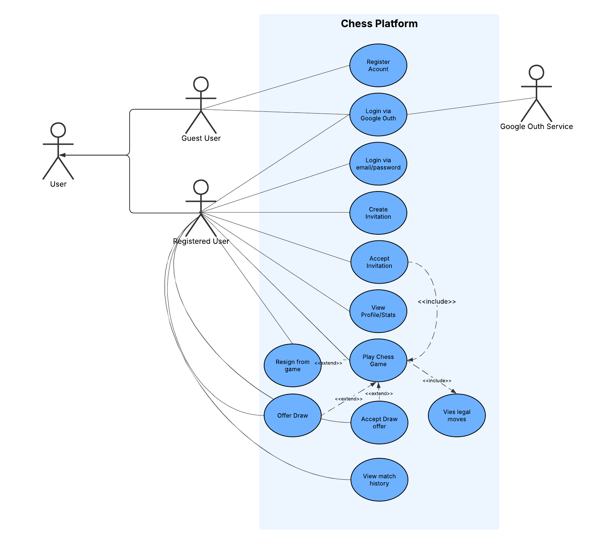
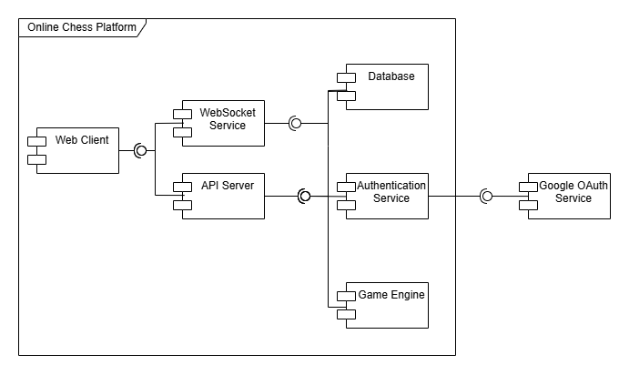
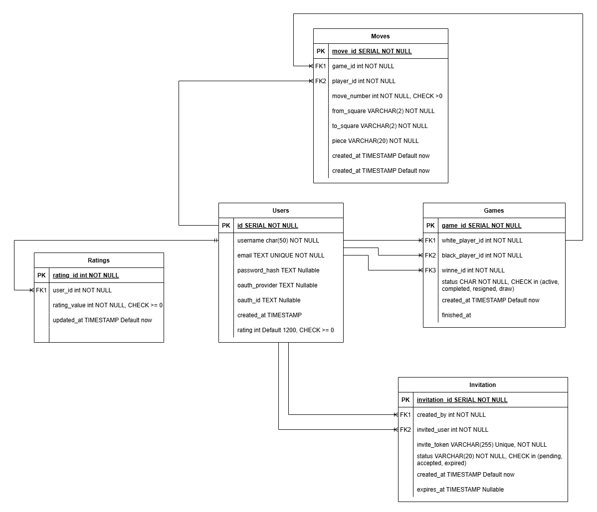
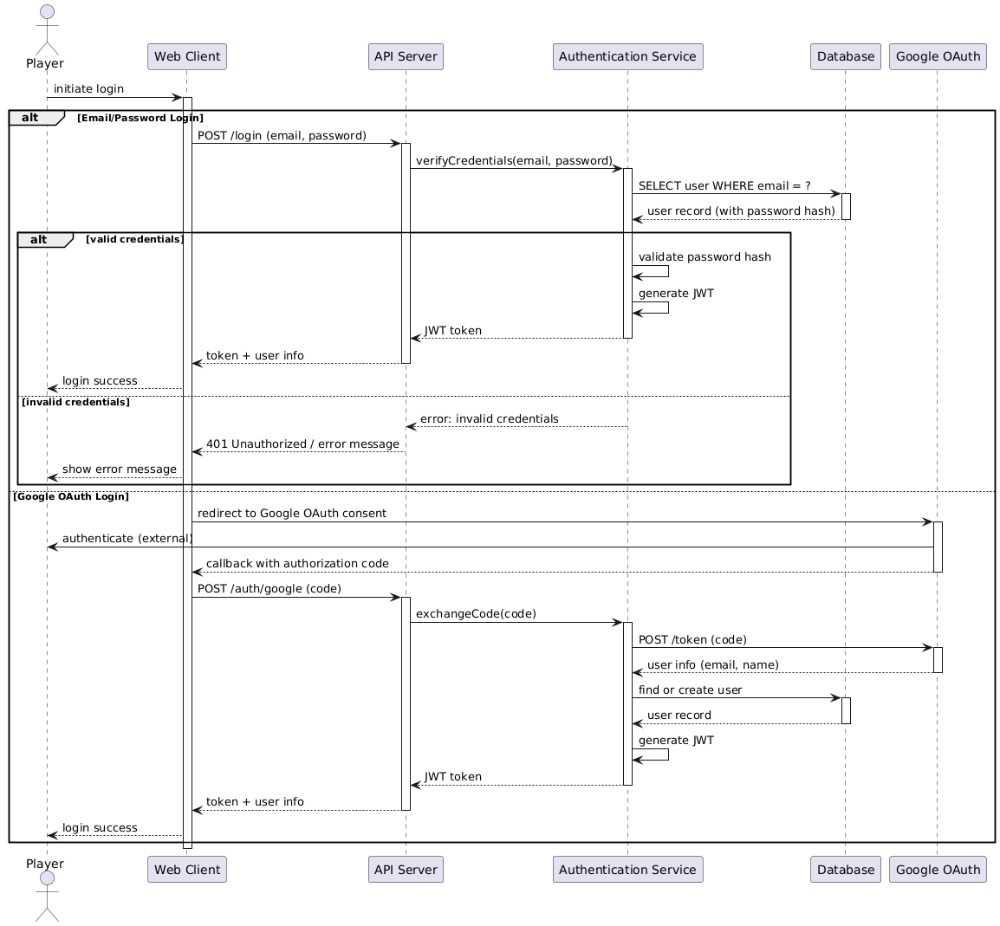
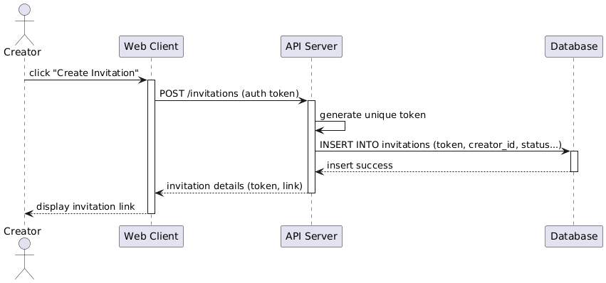
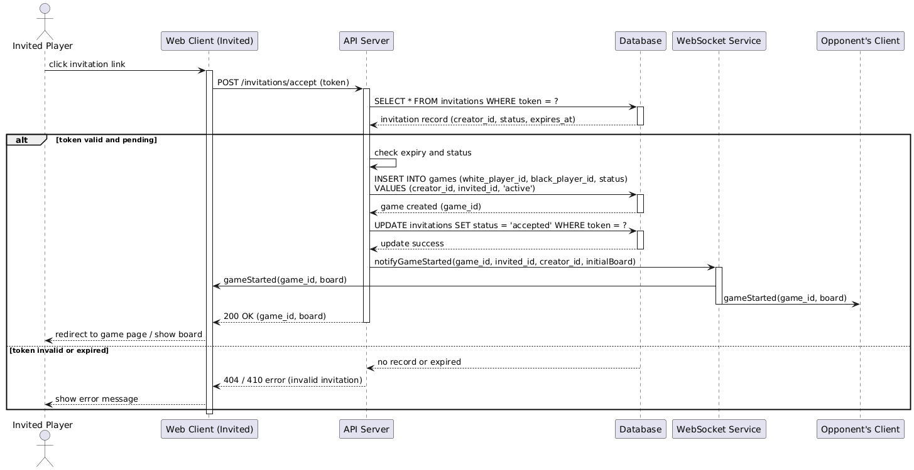
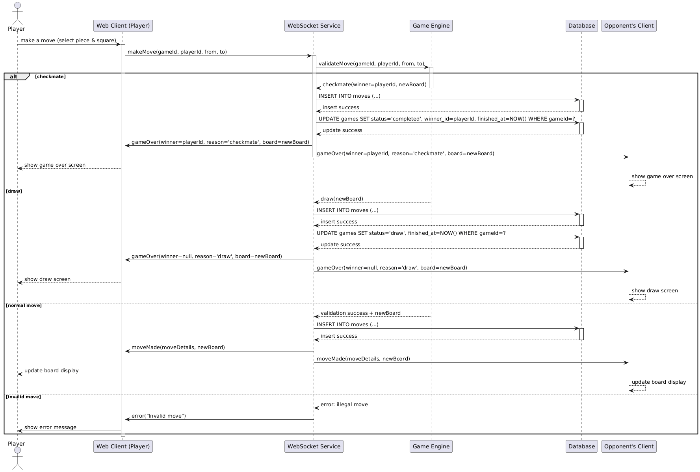
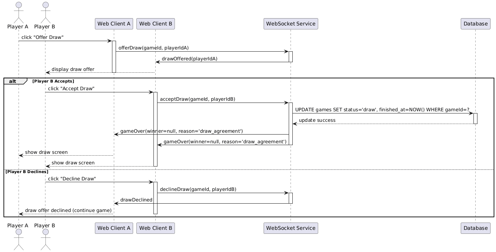

# System Design

## Table of Contents
- [Overview](#1-overview)
- [Use Case Diagram](#2-use-case-diagram)
- [Component Diagram](#3-component-diagram)
- [Entity Relationship Diagram](#4-entity-relationship-diagram)
- [Sequence Diagrams](#5-sequence-diagrams)

## 1. Overview
This document describes the design and architecture of the Online Chess Platform.  
The system enables users to play chess online, manage invitations, track games, and maintain player ratings.

## 2. Use Case Diagram
The use case diagram illustrates the interactions between users (players) and the system.  
Key actors include:
- **Player** – can register, log in, create invitations, accept invitations, make moves, and view game history.
- **Guest** – can only view public information (if applicable).

*Figure 1: Use case diagram of the Online Chess Platform.*

## 3. Component Diagram
The component diagram shows the high‑level architecture of the system, its main components, and the interfaces between them.  
Components include:
- **Web Client** (React) – user interface.
- **API Server** (FastAPI) – handles REST requests.
- **Authentication Service** – manages login and OAuth.
- **Game Engine** – validates chess rules.
- **WebSocket Service** – real‑time updates.
- **Database** (PostgreSQL) – persistent storage.
- **Google OAuth** – external authentication provider.

*Figure 2: UML component diagram with provided/required interfaces.*

## 4. Entity Relationship Diagram
The ER diagram models the database structure.  
Main entities:
- **User** – stores player information and credentials.
- **Game** – records each match, players, status, and winner.
- **Move** – logs every move made in a game.
- **Invitation** – manages game invitations between users.
- **Rating** – (optional) tracks rating history over time.

*Figure 3: Entity relationship diagram of the Online Chess Platform.*

## 5. Sequence Diagrams
Sequence diagrams illustrate the flow of interactions for key use cases in the system.

### 5.1 User Authentication

*Figure 4: Sequence diagram for user login and registration.*

### 5.2 Create Invitation

*Figure 5: Sequence diagram for generating and sharing a game invitation.*

### 5.3 Accept Invitation & Start Game

*Figure 6: Sequence diagram for accepting an invitation and creating a new game.*

### 5.4 Make a Move

*Figure 7: Sequence diagram for a player making a move during a game.*

### 5.5 Resign Game

*Figure 8: Sequence diagram for game termination by resignation.*

### 5.6 Offer/Accept Draw

*Figure 9: Sequence diagram for offering and accepting a draw.*